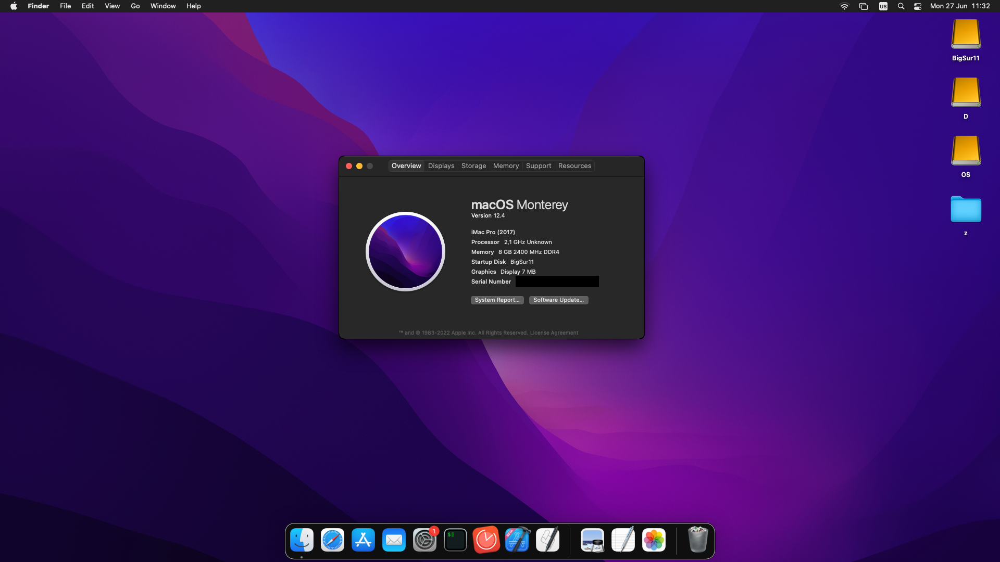
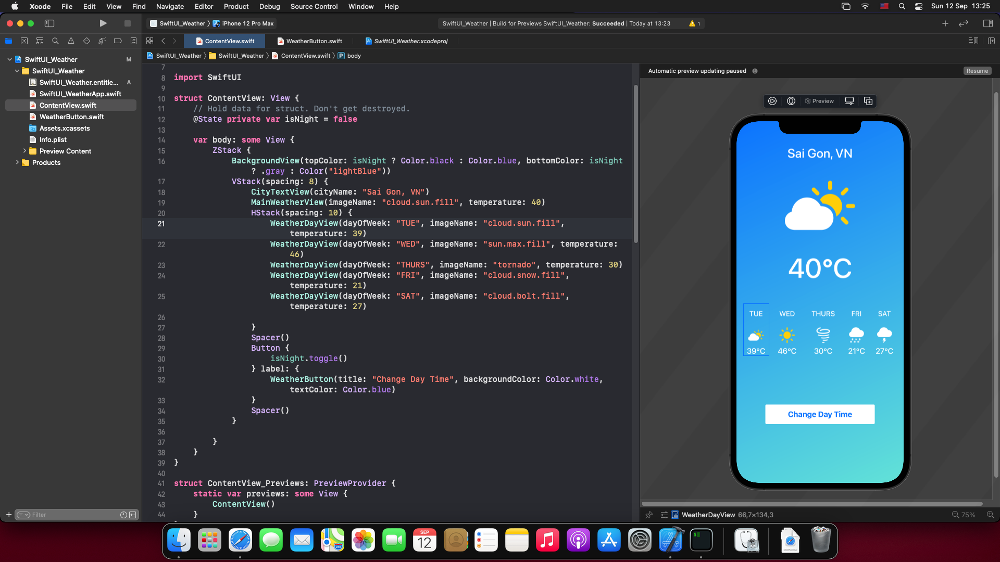

# OpenCore EFI for AMD Laptops (updated to Monterey 12.4)

**OpenCore version: 0.8.8**

**macOS: Monterey 12.4**



My laptop is **Lenovo V15 Gen 2**
- CPU: AMD Ryzen 5 3500U
- Display: AMD Radeon Vega 8
- Network: Intel wireless
- Audio: AMD

**Note**: 
- Please change MLB/ROM/Serial Number/UUID.
- Highly recommend using Wifi by HeliPort app.

There's no audio and video supported, but I mainly use this Hackintosh for iOS development purpose, so not a big deal.

## What's in the box?
```
├── EFI
│   ├── BOOT
│   │   └── BOOTx64.efi
│   └── OC
│       ├── ACPI
│       │   ├──SSDT-CPUR.aml (*)
│       │   ├──SSDT-EC-USBX-AMD.aml (*)
│       │   ├──SSDT-EC-USBX-DESKTOP.aml (*)
│       │   ├──SSDT-EC.aml
│       │   ├──SSDT-HPET.aml
│       │   ├──SSDT-PLUG.aml
│       │   ├──SSDT-PMC.aml
│       │   ├──SSDT-USB-Reset.aml (*)
│       │   ├──SSDT-USBX.aml
│       ├── Bootstrap
│       │   └── Bootstrap.efi
│       ├── config.plist
│       ├── Drivers
│       │   ├── HfsPlus.efi
│       │   ├── OpenCanopy.efi
│       │   └── OpenRuntime.efi
│       ├── Kexts
│       │   ├──ACPIMonitor.kext
│       │   ├──AmdCPUMonitor.kext
│       │   ├──AppleALC.kext
│       │   ├──AppleMCEReporterDisabler.kext
│       │   ├──FakeSMC.kext
│       │   ├──HeliPort.dmg
│       │   ├──Lilu.kext
│       │   ├──NVMeFix.kext
│       │   ├──RadeonMonitor.kext
│       │   ├──RestrictEvents.kext
│       │   ├──SMC-Spoof.kext
│       │   ├──VoodooHDA.kext
│       │   ├──VoodooI2C.kext
│       │   ├──VoodooI2CELAN.kext
│       │   ├──VoodooInput.kext
│       │   ├──VoodooPS2Controller.kext
│       │   ├──WhateverGreen.kext
│       │   ├──XLNCUSBFix.kext
│       │   ├──itlwm.kext
│       ├── OpenCore.efi
│       └── Resources
│           ├── Font
│           ├── Image
│           └── Label
|       ├── Tools
│       │   ├── OpenShell.efi

```
(*) Disabled for custom laptop configurations
## Bonus

